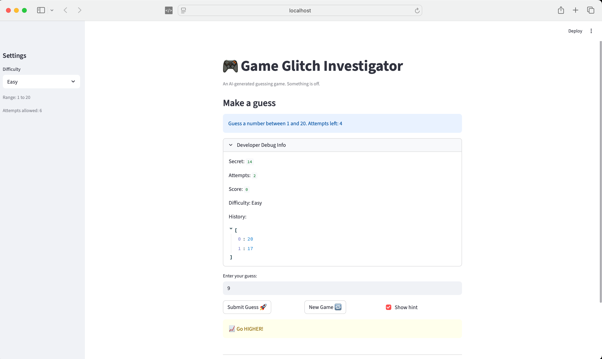

# 🎮 Game Glitch Investigator: The Impossible Guesser

## 🚨 The Situation

You asked an AI to build a simple "Number Guessing Game" using Streamlit.
It wrote the code, ran away, and now the game is unplayable. 

- You can't win.
- The hints lie to you.
- The secret number seems to have commitment issues.

## 🛠️ Setup

1. Install dependencies: `pip install -r requirements.txt`
2. Run the broken app: `python -m streamlit run app.py`

## 🕵️‍♂️ Your Mission

1. **Play the game.** Open the "Developer Debug Info" tab in the app to see the secret number. Try to win.
2. **Find the State Bug.** Why does the secret number change every time you click "Submit"? Ask ChatGPT: *"How do I keep a variable from resetting in Streamlit when I click a button?"*
3. **Fix the Logic.** The hints ("Higher/Lower") are wrong. Fix them.
4. **Refactor & Test.** - Move the logic into `logic_utils.py`.
   - Run `pytest` in your terminal.
   - Keep fixing until all tests pass!

## 📝 Document Your Experience

- [x] Describe the game's purpose. This project is a number guessing game built with Streamlit, where the player selects a difficulty and tries to guess a randomly generated secret number within a limited number of attempts. The goal is to receive hints (“higher” or “lower”) and find the correct number efficiently.
- [x] Detail which bugs you found. I identified several issues in the original AI-generated code. The “New Game” button did not fully reset the game state, so score, history, and status carried over between rounds. The hint logic was reversed, causing incorrect feedback (e.g., telling the player to go higher when the guess was already too high). The app also allowed guesses outside the difficulty range and sometimes generated a secret number that did not match the selected difficulty. Additionally, the secret number logic was unstable due to how Streamlit reruns handled state.
- [x] Explain what fixes you applied. I refactored the core logic into logic_utils.py to separate game logic from UI. I fixed the reversed hint logic in check_guess and ensured all comparisons use numeric values. I updated the “New Game” button to fully reset attempts, score, status, and history. I added logic to reset the game when difficulty changes, ensuring the secret number always matches the selected range. I also enforced input validation so guesses must fall within the allowed range. Finally, I added pytest tests to verify that the core logic behaves correctly.

## 📸 Demo

- [x] []

## 🚀 Stretch Features

- [ ] [If you choose to complete Challenge 4, insert a screenshot of your Enhanced Game UI here]
